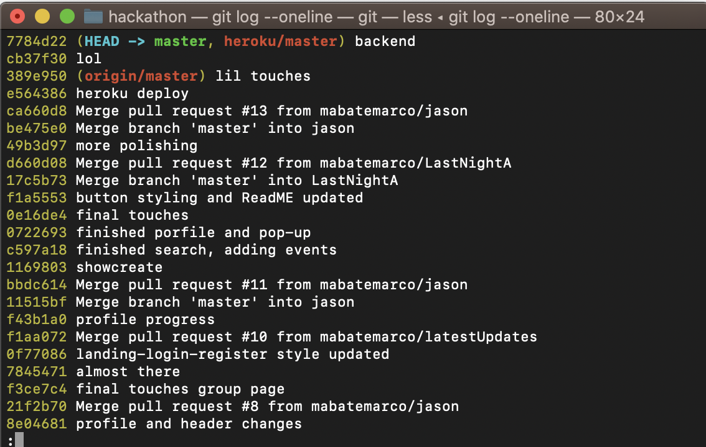
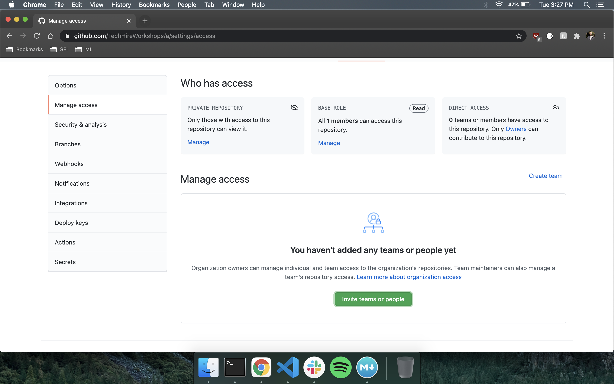
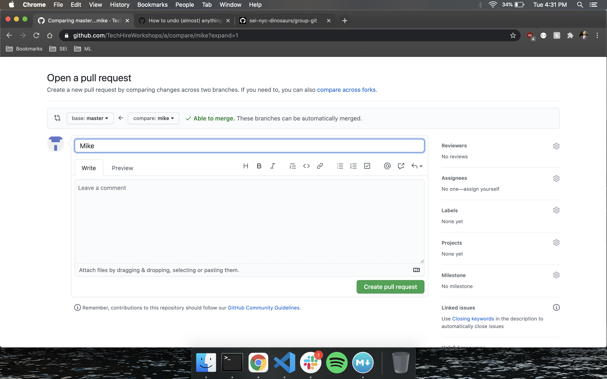
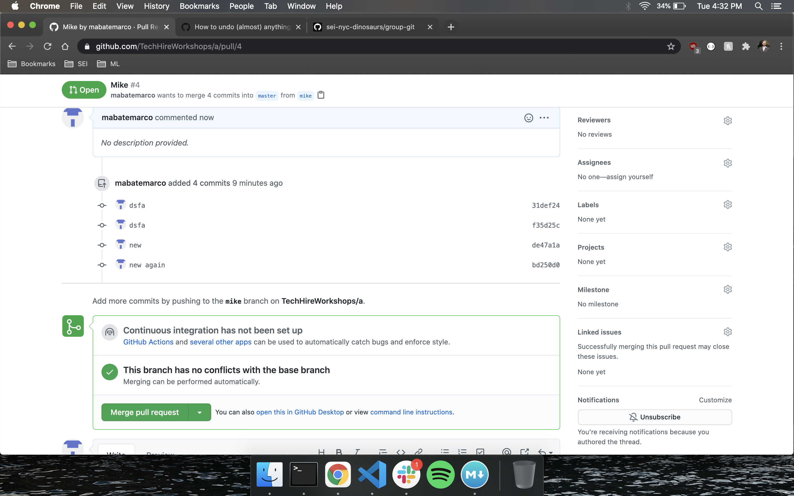
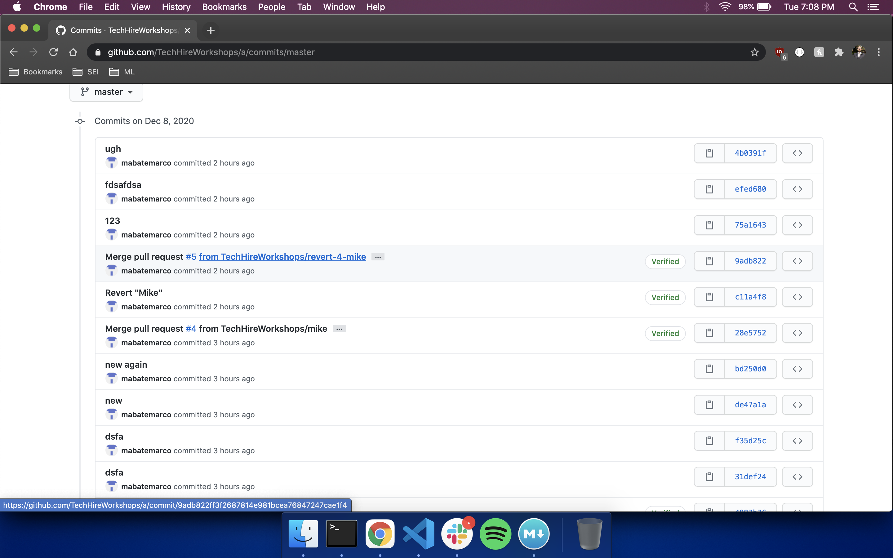
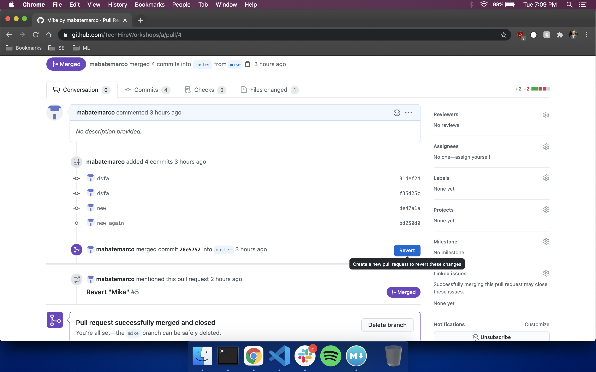
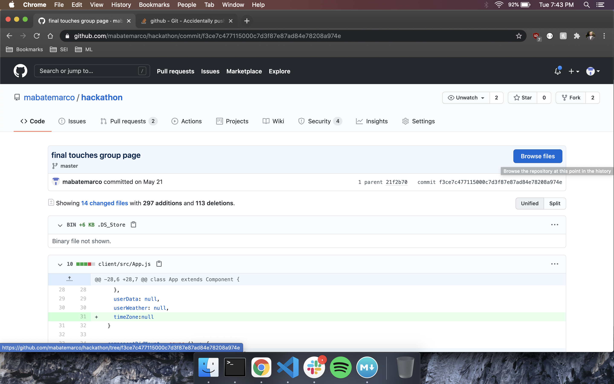
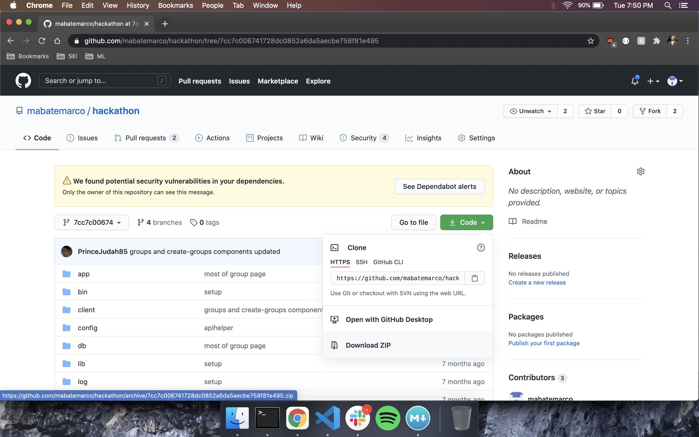

# Using Git and Avoiding Disaster

## What is Git?

Git is the version control technology that allows us to keep track of our projects as it develops.  With git, we can update our projects and view previous versions of the project.  Git also allows collaboration, where a project can be worked on by multiple people at the same time.

Github is a code-hosting platform where coding projects can be stored, edited, and managed using git.  Github is the place to host your projects, and to join in on open-source projects.  There are also plenty of public code repositories where you can view others' code.  It has become synonymous with git itself, but this is not so.

Git exists on your computer separate from GitHub.  It's a way of locally saving the series of changes that a project undergoes as it develops.  What GitHub is, is a place to save your local project git to the cloud.  This allows it to be safely backed up, and shared between collaborators.

## Github Alone

Using GitHub in a situation where you're the only contributor is a good deal easier than in a group, and you're likely already familiar with using GitHub with your own projects.  Let's quickly look over the basics of how git works.

### Creating a New Git Repo

We use the command `git init` to initialize a new git repository. This installs new files that allow git to manage this repository.  Now we need to connect this local repository to our remote GitHub repo. We need to add an origin to our project.  Origin is a naming convention, but a strong one, and refers to the remote repo we want to use for this project.  We would do the following:

	git remote add origin <project GitHub url>
	
Remember that here origin is just the name that we are giving to this remote repo.  We could have called it whatever we want.  We can use this name in the future with other `git remote` commands. For example, running `git remote remove origin`, that would disconnect this remote repo from our local machine.

Find a list of git remote commands [here](https://git-scm.com/docs/git-remote).

### Pushing

The process of pushing to GitHub synchronizes our local and remote gits.  It keeps your GitHub repo current with what you have on your machine.

Adding your local changes to the remote repo is a 3 stage process.  The first thing we do is stage our files using the command

	git add .
	
The staging command starts with `git add`, and is followed by the files that we want staged.  If we put a period after, that means to add all files with changes.  Once we've staged the files, we can check this using 

	git status
	
This will give us a list of files staged to be committed.  We can commit using the command

	git commit -m "some message here"
	
What this does is save the changes on your local repo's git. We need to include `-m "some message describing your changes"` to title the changes, and it pays to be descriptive in case you need to revert to a previous version at some point in the future.  

This brings us to our last step: synchronizing our local and remote gits.  This is the stage where conflicts can occur when working in a group. If there are changes in the remote git that are not in the local, the push will fail and we'll need to deal with that in one of a few possible ways, which we'll get to in the next section. Pushing is done like so:

	git push <repo name> <branch name>

We can also just write `git push` if we want to push to our default repo and branch, which is usually 'origin master.'

### Pulling and Cloning

Pulling from a remote repo to a local one is the process of copying changes from the remote repo to our local project. It is the opposite of pushing.  This is usually done to bring in changes from a collaborator to your local machine. 

	git pull <repo name> <branch name>
	
Like when pushing, if we just write `git pull`, it will use our default repo and branch.

When we're working on our own, it's rare for us to pull from our remote repo, as we're the only one making changes. Except in the case where we are pulling in a copy of another repo.

One way to do this is to initialize a git repo on our computer, add the repo using `git remote add origin <project GitHub url>`, then pull.  A faster way to do this is by cloning. We simply run the command

	git clone <project GitHub url>
	
and it creates a copy of the project, already set up with git, to our machine.

### Reverting to an Earlier Time

Sometimes, we run headlong into a problem without a backup.  Sometimes, we make things worse as we go, and we're left with a string of errors that we can't undo.  When this happens, sometimes the best course of action is to go back to the last working version of our app.  For this, we use `git revert`.  We can revert to a specific commit using its id.  We can run

	git log --oneline
	
to see a list of our commits and their ids.

We then run 

	git revert <commit id>
	
This created an 'anti-commit' that undoes all of the changes after that point, which we can then push up to undo our earlier saves.

This is different from `git reset` which deletes commits from a certain point forward.  For anything that has been pushed up to a public branch, `git revert` is the way to go.

## Github with Friends

Using Git as part of a group is a trickier proposition.  Changes are coming from multiple places, but all of the collaborators are meant to have the same version history.  Let's take a look at how we can work as a group, and some of the problems that can occur in group work.

### Adding Collaborators

Adding collaborators is easy.  Go to your settings, click 'Manage Access', and invite people using their GitHub usernames or email addresses.

Once they've accepted your invitation, they can clone or pull down the repo and get to work.

Now that we have multiple people making changes to the repo, conflicts can occur.  This happens when gits with different changes to the same file attempt to merge.  We can avoid this by making sure that collaborators are not working on the same file at the same time (or by using better methods discussed below).

### Merge Conflicts

We most often run into conflicts when we try to push changes in a file to our remote repo, but there have already been changes made to that file by another coder.  Git tells us that we cannot push our changes because the remote has changes that we do not have locally.  How do we fix this?

#### Fix Locally

One thing we can do is pull down the remote repo after we've committed our changes.  Most code editors will them show the different changes, which we can then select from, and then add, commit, push up the merged version.  This is messy and not advised.  Instead, we should use branches.

### Using Branches

As we saw in our example, everyone working together on one project leads to problems. Branches are the solution to this. Each collaborator in a project can create and work within their own branch.  This can be done locally by running

	git checkout -b <branch name>
	
This creates a new branch and switches your local repo to this new branch.  While  checked out out to this branch, make your changes, and when you push, it will push your git to your branch on GitHub.

From there, we're going to create a pull request.  What this does is request a merge of this branch into the master branch, ensuring that everyone's changes are all part of the main branch of the project.

Navigate to GitHub, switch to your branch, and open a pull request.

Once a pull request is made, we can view it to see if there are any merge conflicts.  If not, we can ok the merge and join it to our master branch.

After pushing up changes from a branch, the branch should be deleted, and the merge version of master should be pulled down.  From there, the coder should create a new branch off master for their next feature.

Let's take a look at a pull request with a merge conflict.

### Reverting a Pull Request

The pull request system is pretty safe, but mistakes do happen.  If a collaborator submits and merges a pull request that shouldn't have been merged, it's simple to correct this.  First, navigate to the commit list in the project's GitHub page.

Select the pull request you want to revert, and click the revert button.  

This will create a new pull request that will undo the previous one.  Once that's merged, you can pull down and be back to where you were.

### What About the Work I've done Since Then?

What if you've done a significant amount of work since the faulty commit?  Are you to lose this work?  The easiest thing to do, is switch to another branch and push up your work.  Make the corrections you need to on your master branch, then create a pull request from the branch you were working on before.

### Cut and Run

Git can get confusing, with commits from different branches and users, resets, reversions, and confusing merges.  If things get too crazy, starting a new git seems like the best course of action.  Navigate to the commit you want to restart from, and click browse files to see the repo at that point in time

You can then download a zip of that version of the repo.

Put that in a new folder, and upload that to a new GitHub file, add your collaborators, and publicly berate whoever ruined the first git.  You're good to go.